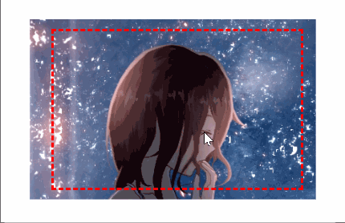

<p align="center" style="font-size: 34px;font-weight: bold;">
    😊css-transform-matrix
</p>

#### This is a CssMatrix class as defined by the [w3c CSS3 3d Transforms](http://www.w3.org/TR/2011/WD-css3-2d-transforms-20111215/#cssmatrix-interface) specification.

You can easily customize what you want with the matrix



## 🎉 Installation
	npm install css-transform-matrix

## 📝 Usage

It should be compatible with documentation defined at [w3.org](http://www.w3.org/TR/2011/WD-css3-2d-transforms-20111215/#cssmatrix-interface) and at [WebKitCSSMatrix](https://developer.apple.com/library/iad/documentation/AudioVideo/Reference/WebKitCSSMatrixClassReference/index.html) Safari documentation.

### 🚀 example

```typescript
import {CssMatrix} from "css-transform-matrix";
const matrix = new CssMatrix();
// 1. move the image down to the right by 30 pixels
matrix.move(30, 30);
// 2. enlarge the image 1.2x at (50, 50)
matrix.scaleAtPoint(1.2, 50, 50);
// 3. rotate the picture 30 degrees clockwise at (50, 50)
matrix.rotateAtPoint(30, 50, 50);
// 4. make your transform work
element.style.transform = matrix.toString();
```

## 🔧 All Methods
- move(x, y)
- moveX(x)
- moveY(y)
- scale(s)
- scaleAtPoint(s, x, y)
- scaleX(s, x)
- scaleY(s, y)
- rotate(degree)
- rotateAtPoint(degree, x, y)
- toString()
